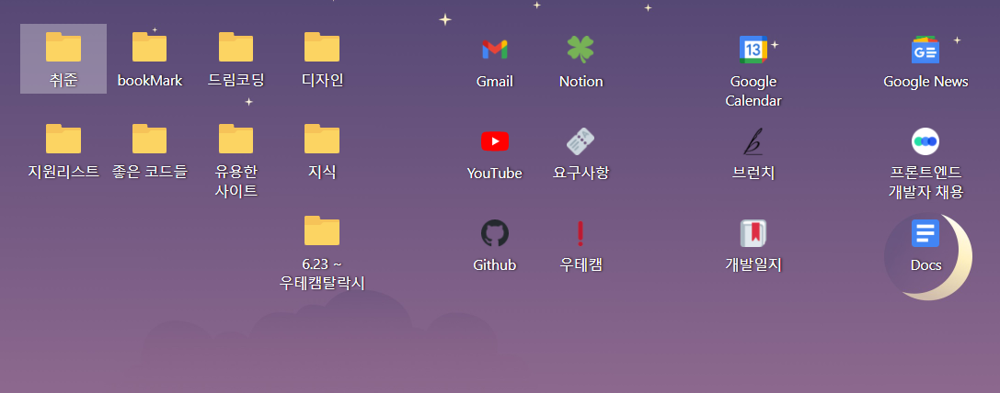

**사용기술** **:** HTML, CSS, JAVASCRIPT

## bookmark wallpaper (2021-04-15 ~ 2021-04-29) [사용**추천** ⭐⭐⭐⭐⭐]



<br>

- **개발 일지 |** [https://www.notion.so/64a8e53756f446b99227ad69cf90fb14](https://www.notion.so/64a8e53756f446b99227ad69cf90fb14)
- **웹스토어 링크** | [Webstore link](https://chrome.google.com/webstore/detail/new-tab-bookmark-manager/hlggoabjcpdkphbmlgoblempopodkaif?hl=ko)
- **사용영상 |** [Youtube link](https://www.youtube.com/watch?v=HhKZuQ-ZudQ)

- **개요 |**

  1. 윈도우 바탕화면처럼 사용하는 북마크 관리기
  2. 크롬의 첫화면을 북마크 관리기로 활용

- **추구한 것 |**

  1. **한 눈에 들어오고, 더 쉽게 관리할 수 있는 북마크 관리기**

     평소 북마크를 정말 많이 걸어두는 편인데, 북마크가 많아지며 눈에 잘들어오지 않고, 관리도 힘들었다.

  2. **더 나은 크롬 첫화면**

     크롬의 첫화면은 자주 접하는 화면인데 비해 잘 활용되지 못하고 낭비되고 있다고 느꼈다.

     북마크가 이 낭비되는 공간을 채워줄 좋은 컨텐츠라고 생각했다.

- **프로젝트를 하며 알게된 것 |**

  1. **흰색 계열 글자**에 shadow를 주면 **가독성**을 높일 수 있다.

     흰색 글자의 가독성이 떨어진다는 것은 앞의 Quick Note 프로젝트에서도 느꼈던 점이다.

     윈도우 바탕화면은 흰색 글자를 사용하는데 왜 눈에 잘 들어오지? 라는 물음을 가지고 관찰해보니 글자 가장자리가 검다는 걸 알게됬고, css 속성 text-shadow 를 줌으로써 가독성을 높일 수 있었다.

  2. chrome favicon api 사용

     아래 api 로 원하는 사이즈의 favicon 을 얻을 수 있다.

     ```
     chrome://favicon/size/256@1x/${bookMark.url}   (256x256 크기 파비콘)
     ```

- **제작 일정**

  1. 2021-04-21 ~ 2021-04-29 : 개발
  2. 2021-04-29 : 배포
  3. 2021-04-30 : 사용자 요구사항 반영 업데이트

- **성과**
  1. 현재 사용자 수 : 54명 (2021-06-12일 기준)
  2. 한국항공대학교 에브리타임 핫게시판 (좋아요 45개)
  3. 디시인사이드 프로그래밍 갤러리 개념글 (추천 22개)
