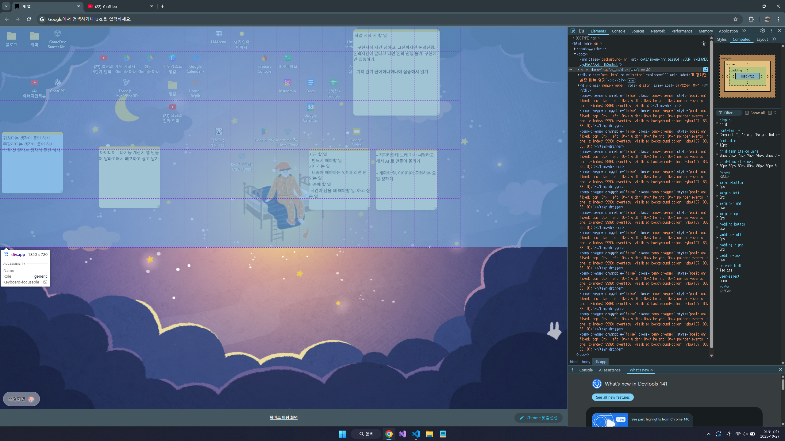

1) 해상도 대응 이슈 [ 어느정도 해결됨. 완전히 만족스럽진 않음. ]
 현재 개발화면은 16:9 비율의 노트북 환경임. 150%와 200% 배율의 화면 상태에서 개발되었음.
 다른 배율환경에서는 버그가 존재함.
 

 사용자의 개선 요청 사항중 가장 많았던 것이 이 문제임. 아이콘의 크기를 변경하게 해달라는 등의 요청들이 있었음.

 문제
 - 현재 하나의 북마크의 크기는 픽셀단위로 고정되어있음. 큰 모니터에서 %100이하의 낮은 배율로 보면 북마크가 들어갈 수 없는 여백이 오른쪽과 아랫쪽에 나오게됨.
 
 해결방안1)
 여백의 발생을 막기 위해서, 하나의 북마크의 크기를 화면의 크기에 대응하게한다.
 그런데 이렇게 했을 때, 화면이 큰 모니터를 사용했을 때 북마크의 크기가 너무 커지는 문제가 있음 현재도 사용자들이 (북마크) 아이콘의 크기를 변경할 수 있게해달라는 요청이 많았음.

 해결방안2)
 화면 크기가 크면 그만큼(북마크) 아이콘의 갯수를 늘려준다. 현재 20x9인데, 이를 화면 크기에 따라 n*m 의 가변적으로 운용하게 하는 것임.
 사용자 편의성 면에서 해결방안1)보다 났다고 생각됨. 그러나 개발시 추가적으로 처리되어야할 문제들이 발생함.

  해결방안2 문제
  - 북마크의 갯수가 가변적일 때, 아이콘을 더 작게 많이 보는 경우에는 뭐 그냥 자리를 늘려준다고 치는데, 아이콘을 더 크게 보는 경우, 더 적은 북마크를 표시하게 되어 문제가 발생함. 

  윈도우즈의 경우 이런 경우에 이전의 좌표가 더이상 화면에 표시되지 않는 경우 가까운 남는 위치에 적절히 배치해주었음. 뭐, 남는 위치 중 가장 가까운 곳으로 배치를 한다는 식의 로직을 작성한다면 어렵지 않을 것 같음. 혹은 그냥 이 문제는 방치해도 큰 문제가 없을 걸로 생각됨. 사용자들이 화면 크기를 조절하다가 어, 전에 나오던게 안보이네 그러면 알아서 보이는 위치에 옮겨서 하든지 할 것임.

 ctrl + 스크롤로 배율을 변경할 때, 배율이 커졌다 작아지거나 작아지거나 커져서 다시 같은 배율로 돌아올 때, 북마크들의 위치가 유지되지 않고 다른 위치에 가는 문제가 있어.
 문제를 해결해줘.

 화면이 커질 수록 좌표 수가 많아지고 작아질 수록 좌표 수가 적어질 거야. 좌표의 index 가 큰 경우가 작은 경우보다 먼저 화면크기에 영향을 받게 해줘. 그러니까,
 [1,2] 인 좌표의 북마크는 웬만해서는 위치가 변경되지 않겠지.

2) [해결] 폴더 생성 안됨 버그 
3) 폴더 매니저 디자인 개선 - 좀 더 심플하게, 최근본순/이름순 영역크기 줄이기, 하늘색 
계열로 변경 [개선필요] 
4) [해결] 폴더 매니저 pointerDown stopPropagation.
5) [해결] 북마크 그리드 사이에 spacing 이 존재하는데 없애줘. 버그를 유발하며 불필요해.

6) [해결] 폴더 매니저 상단 제목 가운데 정렬 (제목 영역이 닫기 버튼과 너비를 공유하기 때문에 가운데에서 왼쪽으로 치우친 걸로 보임.)
7) 클릭시 TempDragger 리셋 안됨 버그 & ECS 누를시 TempDragger 리셋
8) [해결] grid 사이에 불필요한 빈공간생김 해결
9) 포스트잇 디자인 레이아웃 및 디자인 개선 - 색상 변경시 상단 영역 색상도 변경 & 색상 변경 버튼 포스트잇 외곽으로 빼기
10) 포스트잇 pointerDown stopPropagation
11) 배경화면 변경 버튼 지금보다 작게, 왼쪽 하단에 붙어있으면서 오른쪽에 숨기기 토글 버튼 있음.
12) 포스트잇 상단 클릭해서 제목입력 가능하게하기.
13) 포스트잇 배치할 때 그리드 형태로 배치. 자유배치는 shift 누르고 

14) multi drag 중에도 각 북마크가 드롭될 위치 표시 (단일 드래그 때와 같이)
15) multi drag 자기 자신 북마크들 다시 드래그하면 유지되게.
 
 - [후보] 시간표(일정) 관리 기능