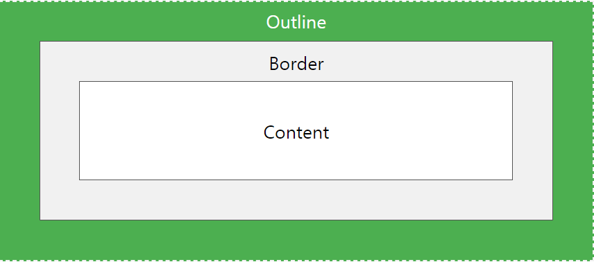

### white-space

- normal : 자동 줄바꿈 o (개행 문자 -> 다른 공백문자와 동일) & 연속 공백 1개로 합침.
- nowrap : 연속 공백 1개로 합침 & 자동 줄바꿈 x (br 으로 명시해줘야한다.)
- pre : 연속 공백 유지 & 자동 줄바꿈 x (개행문자, br)
- pre-wrap : 연속 공백 유지 & 자동 줄바꿈 o
- pre-line : 연속 공백 1개로 합침 & 자동 줄바꿈 o

### word-break

글자 기준 개행 or 단어 기준 개행 정하는 속성

- normal : CJK 문자는 글자 기준으로, CJK 이외의 문자는 단어 기준으로 줄바꿈합니다.
- break-all : 글자 기준으로 줄바꿈합니다.
- keep-all : 단어 기준으로 줄바꿈합니다.

### a tag 색, 밑줄 제거

- color: #000;
- text-decoration: none;

### :hover, :focus 속성 적용 범위

호버시 커서 포인터가 되는 등 기본 동작을 막고 싶을 때,
꼭 :hover 속성에 명시하지 않고 요소에 속성 지정 해도 된다.

### 배경색만 투명하게 하고 싶을 때

- opacity (X)
- rgba (O)

### focus, active, active.focus

- active : "활성" 마우스 버튼 누른 순간 ~ 떼는 순간
- focus : 클릭, 탭.
  - focus-within : 자손이 포커스 될 때도 포함.

### outline vs border

https://www.w3schools.com/css/css_outline.asp

- outline 은 border 밖에.
  

### 1fr

그리드 컨테이너 내 공간 비율을 분수로 나타내는 방법.
픽셀등의 정적인 단위로 채워진 공간을 제외하고 남는 공간에서
차지할 비율을 뜻한다.

    ex) grid-template-columns: auto 100px 1fr 2fr;
    - auto 와 100px 이 차지하는 공간을 제외하고
    1:2 만큼의 공간을 차지한다.
